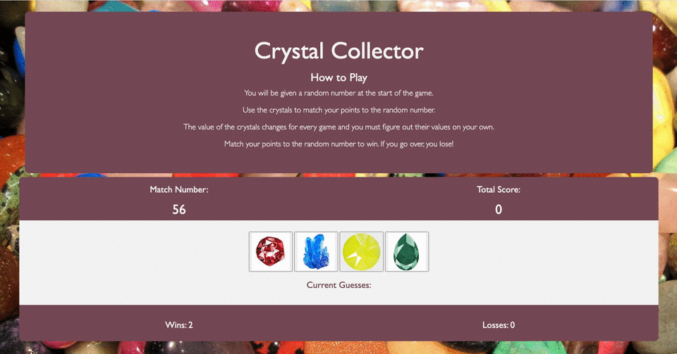

# Crystal Collector Game

### Overview:
A fun and interactive game for web browsers built using HTML5, CSS, Bootstrap, JavaScript and jQuery.

## Author:
Lindsey Tummond
- <a href="https://lindseytummond.github.io/portfolio/" target="_blank"> Portfolio </a>
- <a href="https://github.com/lindseytummond" target="_blank"> GitHub </a>
- <a href="https://www.linkedin.com/in/lindsey-tummond-b86aa341/" target="_blank"> LinkedIn </a>

## Learning Points:
- Using `setTimeout()` method to call a function after a specified number of milliseconds
- Utilization of `Math.floor` and `Math.random`
- Understanding of multiple files and how to link file structure

## Technologies:
-   HTML
-   CSS
-   Javascript
-   jQuery
-   GitHub

## How to Play:
Use the following link https://lindseytummond.github.io/unit-4-game/ to open the application.  
Players will be given a random number at the start of the game. Use the crystals to match your points to the random number. The value of the crystals changes for every game and users must figure out their values on their own.

Match points to the random number to win. If the player goes over, you lose!

## App Example:

  

